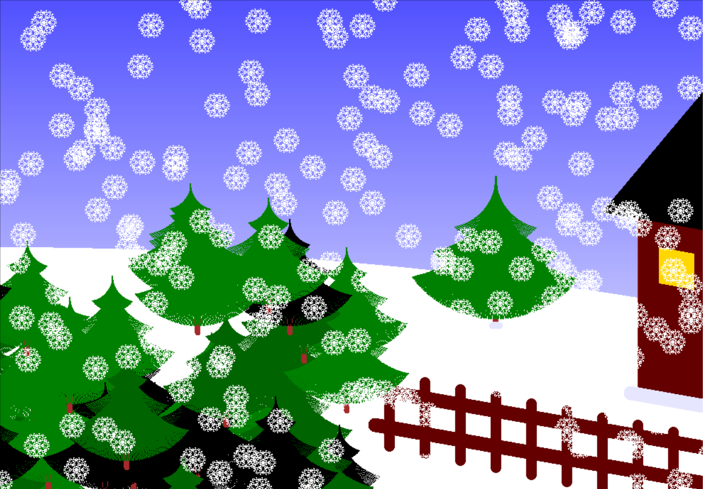

- This is a picture of a jungle created by python codes(turtle framework).
-  

 

- And this is how I did it:
<pre>
import turtle
import random
screen = turtle.Screen()
screen.colormode(255)
screen.setup(1000, 700)
turtle.tracer(0)

def sky():
    r = 255
    g = 255
    c = 0
    for i in range(-350, 351):
        t = turtle.Turtle()
        t.hideturtle()
        t.pencolor(r, g, 255)
        t.penup()
        t.setpos(-500, i)
        t.pendown()
        t.forward(1000)
        c = c+1
        if c == 4:
            r = r - 1
            g = g - 1
            c = 0

def loc():
    x = random.randrange(-600, 0, 10)
    y = random.randrange(-400, 100, 10)
    return x, y

def color_tree():
    color = ["darkgreen", "green", "black"]
    c = random.choice(color)
    return c

def loc_s():
    a = random.randrange(-500, 500)
    b = random.randrange(-350, 350)
    return a, b

def house():
    h = turtle.Turtle()
    h.pencolor("brown")
    h.hideturtle()
    h.penup()
    h.setpos(400, -200)
    h.pendown()
    h.setheading(90)
    for _ in range(2):
        h.begin_fill()
        h.fillcolor(100, 0, 0)
        h.forward(300)
        h.right(100)
        h.forward(300)
        h.right(80)
        h.end_fill()
    sh = turtle.Turtle()
    sh.hideturtle()
    sh.pencolor(230, 230, 255)
    sh.pencolor()
    sh.pensize(20)
    sh.penup()
    sh.setpos(390, -205)
    sh.pendown()
    sh.setheading(350)
    sh.forward(200)
    r = turtle.Turtle()
    r.hideturtle()
    r.penup()
    r.setpos(350, 50)
    r.pendown()
    r.setheading(50)
    r.begin_fill()
    r.fillcolor("black")
    r.forward(300)
    r.right(120)
    r.forward(300)
    r.right(120)
    r.forward(300)
    r.end_fill()
    w = turtle.Turtle()
    w.pencolor("gold")
    w.hideturtle()
    w.penup()
    w.setpos(430, -50)
    w.pendown()
    w.setheading(90)
    for _ in range(2):
        w.begin_fill()
        w.fillcolor("gold")
        w.forward(50)
        w.right(100)
        w.forward(50)
        w.right(80)
        w.end_fill()
    n = turtle.Turtle()
    n.hideturtle()
    n.pencolor(100, 0, 0)
    n.pensize(20)
    n.penup()
    n.setpos(30, -250)
    n.pendown()
    n.setheading(350)
    n.forward(500)
    n2 = turtle.Turtle()
    n2.hideturtle()
    n2.pencolor(100, 0, 0)
    n2.pensize(20)
    n2.penup()
    n2.setpos(30, -200)
    n2.pendown()
    n2.setheading(350)
    n2.forward(500)
    for i in range(10):
        n = turtle.Turtle()
        n.hideturtle()
        n.pencolor(100, 0, 0)
        n.pensize(15)
        n.penup()
        n.setpos(50+i*50, -180-i*10)
        n.pendown()
        n.setheading(270)
        n.forward(100)

def shape(l, snowflake):
    if l < 6:
        snowflake.forward(l//2)
        snowflake.left(135)
        snowflake.forward(l//2)
        snowflake.left(30)
        snowflake.forward(l//4)
        snowflake.right(90)
        snowflake.forward(l//8)
        snowflake.right(90)
        snowflake.forward(l//4)
        snowflake.left(150)
        snowflake.forward(l//3)
        snowflake.right(90)
        snowflake.forward(l//10)
        snowflake.right(90)
        snowflake.forward(l//3)
        snowflake.left(150)
        snowflake.forward(l//4)
        snowflake.right(90)
        snowflake.forward(l//8)
        snowflake.right(90)
        snowflake.forward(l//4)
        snowflake.left(30)
        snowflake.forward(l//2)
        snowflake.left(45)
        snowflake.forward(l//2)
        snowflake.left(90)
        snowflake.forward(l//2)
        snowflake.left(30)
        snowflake.forward(l//4)
        snowflake.right(90)
        snowflake.forward(l//8)
        snowflake.right(90)
        snowflake.forward(l//4)
        snowflake.left(150)
        snowflake.forward(l//3)
        snowflake.right(90)
        snowflake.forward(l//8)
        snowflake.right(90)
        snowflake.forward(l//3)
        snowflake.left(150)
        snowflake.forward(l//4)
        snowflake.right(90)
        snowflake.forward(l//8)
        snowflake.right(90)
        snowflake.forward(l//4)
        snowflake.left(30)
        snowflake.forward(l//2)
        snowflake.left(90)
        snowflake.forward(l//2)
        snowflake.left(45)
        snowflake.forward(l//2)
        snowflake.left(30)
        snowflake.forward(l//4)
        snowflake.right(90)
        snowflake.forward(l//8)
        snowflake.right(90)
        snowflake.forward(l//4)
        snowflake.left(150)
        snowflake.forward(l//3)
        snowflake.right(90)
        snowflake.forward(l//8)
        snowflake.right(90)
        snowflake.forward(l//3)
        snowflake.left(150)
        snowflake.forward(l//4)
        snowflake.right(90)
        snowflake.forward(l//8)
        snowflake.right(90)
        snowflake.forward(l//4)
        snowflake.left(30)
        snowflake.forward(l//2)
        snowflake.left(135)
        snowflake.forward(l//2)
    else:
        for _ in range(6):
            shape(l*3//4, snowflake)
            snowflake.right(60)

def kaj(l, s, z, x, y):
    if l >= -0.8:
        t = turtle.Turtle()
        t.penup()
        t.hideturtle()
        t.setpos(x, y)
        t.pendown()
        t.pencolor(tree_c)
        t.pensize(z)
        t.setheading(270)

        for _ in range(100):
            t.forward(s)
            t.right(l)
        kaj(l-0.02, s, z, x, y)
        return t

def ta():
    ta = turtle.Turtle()
    ta.color("brown")
    ta.pensize(8)
    ta.penup()
    ta.hideturtle()
    ta.setpos(x, y-80)
    ta.pendown()
    ta.setheading(270)
    ta.forward(80)

def snow():
    for i in range(500):
        s = turtle.Turtle()
        s.pencolor("white")
        s.hideturtle()
        s.penup()
        s.setpos(-500, 0-i)
        s.pendown()
        for _ in range(1000):
            s.forward(1)
            s.right(0.01)

def big_tree(l, s, z):
    if l >= -0.8:
        t = turtle.Turtle()
        t.penup()
        t.hideturtle()
        t.setpos(200, 100)
        t.pendown()
        t.pencolor("green")
        t.pensize(z)
        t.setheading(270)

        for _ in range(100):
            t.forward(s)
            t.right(l)
        big_tree(l-0.02, s, z)
        return t

def taneh():
    ta = turtle.Turtle()
    ta.color("brown")
    ta.pensize(8)
    ta.penup()
    ta.hideturtle()
    ta.setpos(200, -30)
    ta.pendown()
    ta.setheading(270)
    ta.forward(80)
    sha = turtle.Turtle()
    sha.hideturtle()
    sha.pensize(10)
    sha.pencolor(230, 230, 255)
    sha.penup()
    sha.setpos(195, -110)
    sha.pendown()
    sha.forward(10)

sky()
snow()
house()
for _ in range(50):
    tree_c = color_tree()
    x, y = loc()
    ta()
    t = kaj(0.8, 0.5, 0.5, x, y)
    t.setpos(x, y-30)
    kaj(0.8, 1, 1, x, y)
    t.setpos(x, y-80)
    kaj(0.8, 1.5, 1.5, x, y)

taneh()
t = big_tree(0.8, 1, 1)
t.penup()
t.setpos(200, 70)
t.pendown()
big_tree(0.8, 1.5, 1.5)
t.setpos(200, 20)
big_tree(0.8, 2, 3)

for _ in range(200):
    snow_t = turtle.Turtle()
    snow_t.pencolor("white")
    snow_t.hideturtle()
    snow_t.penup()
    snow_t.setpos(random.randint(-500, 500), random.randint(-350, 350))
    snow_t.pendown()
    shape(9, snow_t)

turtle.update()
turtle.mainloop()
</pre>
# this is a header
